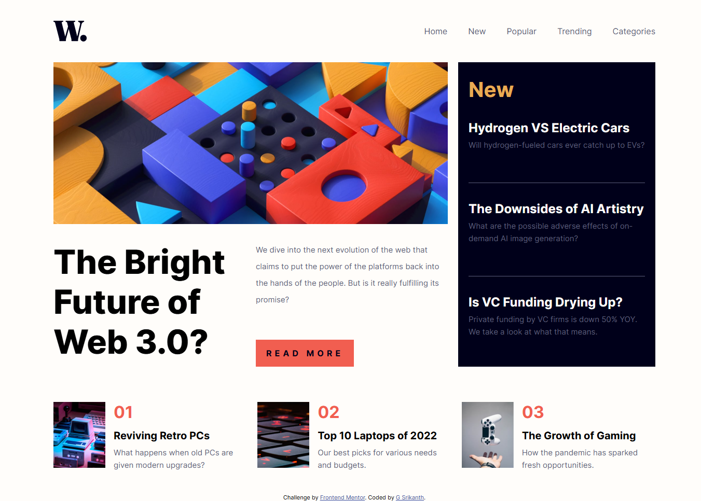
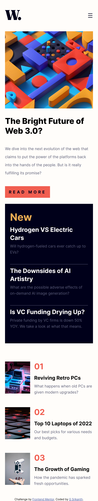

# Frontend Mentor - News homepage solution

This is a solution to the [News homepage challenge on Frontend Mentor](https://www.frontendmentor.io/challenges/news-homepage-H6SWTa1MFl). Frontend Mentor challenges help you improve your coding skills by building realistic projects. 

## Table of contents

- [Overview](#overview)
  - [The challenge](#the-challenge)
  - [Screenshot](#screenshot)
  - [Links](#links)
- [My process](#my-process)
  - [Built with](#built-with)
  - [What I learned](#what-i-learned)
  - [Continued development](#continued-development)
  - [Useful resources](#useful-resources)
- [Author](#author)
- [Acknowledgments](#acknowledgments)


## Overview

### The challenge

Users should be able to:

- View the optimal layout for the interface depending on their device's screen size
- See hover and focus states for all interactive elements on the page

### Screenshot




### Links

- Solution URL: [ solution URL ](https://github.com/shrikanth-dev/news-homepage-main)
- Live Site URL: [ live site URL ]()

## My process

### Built with

- Semantic HTML5 markup
- CSS custom properties
- Flexbox
- CSS Grid
- Mobile-first workflow
- Responsive design with media queries
- Local font integration using `@font-face`
- Vanilla JavaScript for menu toggle


### What I learned

While building this project, I learned:
- How to integrate and apply local fonts using `@font-face`.
- Implementing responsive navigation menus for desktop and mobile views.
- Using the `<picture>` element for adaptive image loading.
- Structuring CSS for scalable responsive layouts.

**Code snippet for mobile nav toggle:**
```javascript
const menuToggle = document.getElementById("menu-toggle");
const closeBtn = document.getElementById("close-btn");
const mobileNav = document.getElementById("mobile-nav");

menuToggle.addEventListener("click", () => {
  mobileNav.classList.add("active");
});

closeBtn.addEventListener("click", () => {
  mobileNav.classList.remove("active");
});

### Continued development

In the future, I want to:

- Add smooth animations to mobile navigation.
- Implement dark/light mode toggle.
- Use CSS variables for better theme management.

### Useful resources

- MDN Web Docs – @font-face
- CSS Tricks – Responsive Menus
- Frontend Mentor – for project inspiration

## Author

- Website - [G Srikanth](https://shrikanthdev-portfolio.vercel.app/)
- GitHub - [shrikanth-dev](https://github.com/shrikanth-dev)
- Frontend Mentor - [@shrikanth-dev](https://www.frontendmentor.io/profile/shrikanth-dev)

## Acknowledgments

Thanks to Frontend Mentor for the project idea and community feedback.
